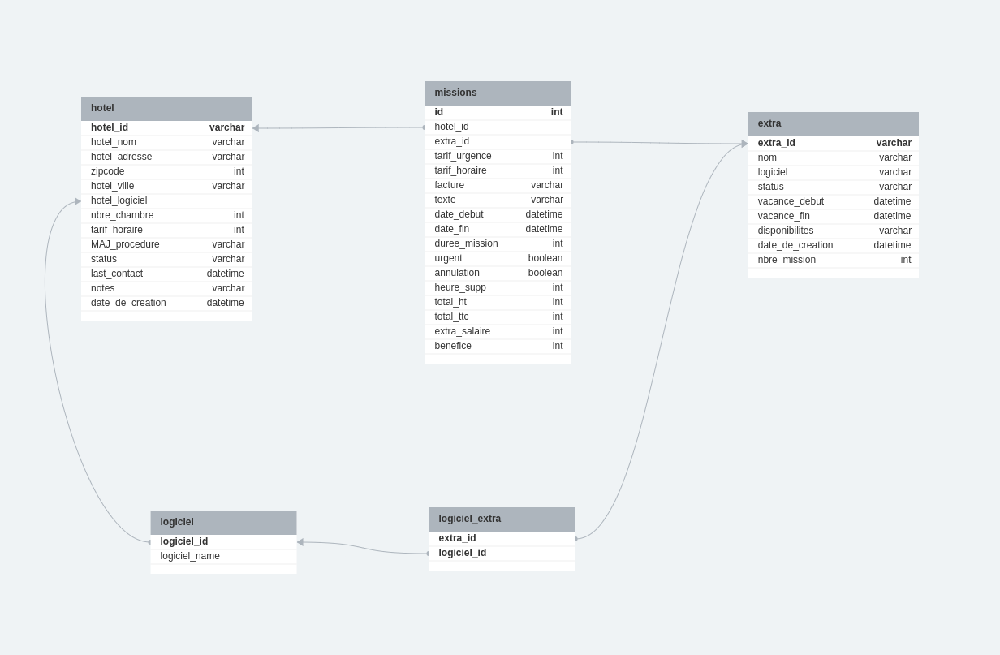

# Projet_final
Projet final de la formation Data analyst à JEDHA BOOTCAMP

# Contexte

La société Qxxxxxxxxa est une entreprise de mise en relation entre des hôtels et des extras pour des missions ponctuelles de réceptionniste. 
Elle nous a sollicité afin de réaliser 3 taches principales :
- mettre en place une base de données relationelle 
- construire un dashboard alimenté par cette BDD
- prédire le nombre de missions futur pour anticiper le besoin en extras

L'ensemble des données de l'entreprise est pour l'instant stocké dans Notion mais à terme sera hébergé dans une RDMS qui sera connectée au site web de l'entreprise.
Nous avons à notre disposition plusieurs fichiers csv extraits de Notion.

**anonimisation à rédiger**


# Methodologie

Nous avons construit une infrastructure de données comprenant un Datalake pour l'hébergement des fichiers csv brut (Amazon S3) et un Datawarehouse (Amazon RDS) contenant les données transformées. La transformation a été effectuée via Python. 
Nous avons utilisé l'outil Looker Studio de Google pour la création du dashboard. 
Nous avons utilisé Dataiku pour la prédiction.


# Pipeline Data (From CSV to RDS)

## Structure du dossier 
```bash

final_project/
|-- assets/
|   |-- création de table.sql
|   |-- projet_final_diagramme.png
|-- anonymisation.py
|-- connexion.py
|-- load_data.py
|-- transform.py
|-- main.py
```

## Connexion 
Le fichier (`connexion.py`) permet la connexion avec le bucket S3. On utilise la bibliothèque Boto3 qui permet d'interagir avec les services AWS. 

## Extract
Le fichier (`connexion.py`) permet également de récuperer les données brut présnetes dans le bucket S3

## Transform
Le script (`tranform.py`) rassemble l'ensemble des transformations effectués sur les données. 
### Fonctions Principales

1. **foreign_key_setup(missions, hotels, extras):**
   - Crée les clés étrangères dans les DataFrames missions, hotels, et extras.
   
2. **transform_missions(missions):**
   - Transforme la colonne 'date' en 'date_debut' et 'date_fin'.
   - Ajoute une colonne 'duree_mission' en heures.
   - Transforme la colonne 'statuts' en colonnes 'urgent' et 'annulation'.
   - Ajoute les colonnes 'heures_supp', 'Total_HT', 'Total_TTC', 'extra_salaire', 'benefice'.
   - Renomme les colonnes pour la connexion PostgreSQL - Looker.

3. **transform_extra(extras):**
   - Transforme la colonne 'vacances' en 'vacance_debut' et 'vacance_fin'.
   - Transforme la colonne 'Disponibilités'.
   - Renomme les colonnes.

4. **transform_hotel(hotels):**
   - Transforme la colonne 'Date de création'.
   - Supprime les espaces au début et à la fin des colonnes texte.
   - Renomme les colonnes pour la connexion PostgreSQL - Looker.

5. **create_table_logiciel(extras):**
   - Crée une table des logiciels.

6. **join_table_logiciel_extra(extras, logiciel_df):**
   - Crée une table de jointure entre logiciel et extra.

7. **echantillonnage(missions, hotels, extras):**
   - Effectue un échantillonnage des DataFrames hotels et extras.
   - Filtrage des missions en fonction de cet échantillon.

8. **rescale(missions, hotels):**
   - Effectue le rescale des colonnes financières dans les DataFrames missions et hotels.

9. **ml_transform_semaine(missions_transform):**
   - Crée les données pour la prédiction par semaine.


## Load
Le script (`load_data.py`) permet de charger les données dans Amazon RDS. 
Il s'appuie sur la librairie SQLalchemy pour créer une connexion 
### Fonctions Principales
1. **Création de l'engine pour la connexion au RDS :**
Le script crée un engine à l'aide de SQLAlchemy en utilisant les informations d'identification.
Cela permet d'établir une connexion sécurisée au RDS.
Afin d'établir la connexion il est ncéssaire de disposer des informations de connexion suivantes:

```bash
AWS_RDS_ENDPOINT: Endpoint du RDS.
AWS_RDS_REGION: Région AWS du RDS.
DBNAME: Nom de la base de données.
AWS_RDS_USER: Nom d'utilisateur pour la connexion au RDS.
AWS_RDS_PASSWORD: Mot de passe pour la connexion au RDS.
AWS_RDS_PORT: Port utilisé pour la connexion au RDS.

```

2. **Chargement des données dans les tables RDS :**
Les données transformées sont chargées dans les tables correspondantes du RDS. 
Si les tables existent déjà, les données existantes sont remplacées par les nouvelles données, 
ce qui facilite le processus pendant les phases de test et de développement.

# Dashboard enlight résult for buseniss analytics 
## gif de présentation 


# Resultats
Nous avons proposé à la société Qxxxxxxxxa:
- une RDMS avec plusieurs tables permettant de stocker les informations nécessaires à l'activité de l'entreprise (cf. schéma du Logical Data Model). Cette base de donnée a servi pour la construction du dashboard mais peut etre réutilisée et enrichie lorsque le site web de la société sera déployé.
- un dashboard dans Looker avec plusieurs pages qui permet à la fois le reporting et le pilotage des opérations quotidiennes. Concernant le reporting, le dashboard inclut les KPIs utiles à l'entreprise pour évaluer sa performance passée et actuelle. Concernant le pilotage, le dashboard permet de visualiser les missions prévues / d'identifier les missions à affecter à un extra / de trouver l'extra pertinent pour une mission donnée / d'estimer le nombre de missions à venir...
- les résultats de prédiction de Dataiku ont été intégrés dans Looker pour la visualisation. Les prédictions ont été réalisé par semaine pour les 4 prochaines semaines en utilisant les données historiques (104 semaines). Le modèle le plus performant parmi ceux testés est le NPTS (MAPE 12%), c'est celui qui a été utilisé pour la prédiction. 

# Description des fichiers contenu dans le projet
- anonymisation : anonymisation des données (noms hôtels, extras, adresse) pour des raisons de confidentialité
- main : script principal qui appellent l'ensemble des autres scripts
- connexion : connexion à Amazon S3 pour la récupération des csv
- transform : transformation des données afin d'avoir un format exploitable pour la visualisation
- load_data : envoi des données transformées vers Amazon RDS
- .gitignore : pour ignorer le fichier .env (données confidentielles) lors du push vers github 
- LDM_RDS.png : image contenant le modèle data logique pour la RDS




**Auteur:** 


